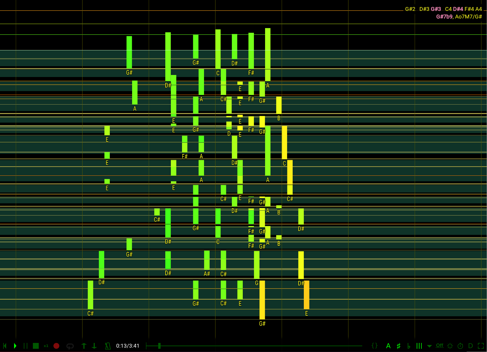

# MVV - MIDI Velocity Visualizer

## Synopsys

[MVV](https://omakoto.github.io/mvv/) is an online MIDI input visualizer, created for piano learners.

## Keys

- `1` or `F1`: Hide screen
- `2` or `F2`: Freeze roll pane
- `F` or double tap anywhere : Toggle full-screen
- `R`: Record start/stop
- `SPACE`: Playback start / pause
  - `Left`/`Right`: during playback -- Rewind/Fast-forward
- `Z`: Stop playback
- `S`: Save the last recording as a midi file
- `L`: Load a `*.mid` file
- `3`: Show FPS and playback timer resolution.

## Supported midi events

- Only note ons/offs and the pedal depth will be visualized.
- Other MIDI events are not visualized, but MVV will/should still record / play them; not tested though.

## Bugs/TODOs

- [ ] P4: Re-architect it
- [ ] P1: Always recording
  - [ ] Estimate RAM consumption
  - [ ] Throttle control (at least the pedal) changes if needed.
  - [ ] Auto-detect between pieces
- [ ] P3: Better playback (as a geneal MIDI player)
  - [ ] Fast-forward should send all skipped control changes
  - [ ] Rewind should replay all control changes
- [ ] P4: Actually sync the renderer to vsync (how?)
- [ ] P4: Support SMPTE time format in *.mid files
- [ ] P4: Add help (not important now that we have buttons)
- [X] P1: On-screen playback/recording controls
  - [X] Play/Record/Stop/Pause/RewindToTop
  - [ ] ~~FF/Rewind -> not needed, now that we have the position bar~~
  - [X] Video mute
  - [X] Pane freeze
  - [X] Current position
- [X] Show confirmation dialog before over-recording or loading
- [X] Prevent text selection
- [X] Support pausing
- [X] Keep playing while in the BG too
- [X] Don't use `prompt()` (which stops playback)
- [X] Support loading a *.mid file
  - [X] Support self-created mid files
  - [X] Support other mid files
- [X] Constant scroll speed regardless of FPS
  - It should be mostly fixed with double-buffering now, as long as updating the hidden buffer finishes within 16 ms.
- [X] Show playback timestamp
